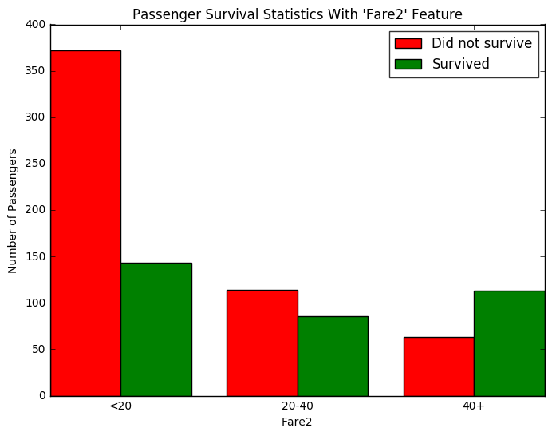

# Machine Learning Engineer Nanodegree
## Introduction and Foundations
## Project: Titanic Survival Exploration

```python
# Import libraries necessary for this project
import numpy as np
import pandas as pd
from IPython.display import display # Allows the use of display() for DataFrames

# Import supplementary visualizations code visuals.py
import visuals as vs

# Pretty display for notebooks
%matplotlib inline

# Load the dataset
in_file = 'titanic_data.csv'
full_data = pd.read_csv(in_file)

# Print the first few entries of the RMS Titanic data
display(full_data.head())
```


<div>
<table border="1" class="dataframe">
  <thead>
    <tr style="text-align: right;">
      <th></th>
      <th>PassengerId</th>
      <th>Survived</th>
      <th>Pclass</th>
      <th>Name</th>
      <th>Sex</th>
      <th>Age</th>
      <th>SibSp</th>
      <th>Parch</th>
      <th>Ticket</th>
      <th>Fare</th>
      <th>Cabin</th>
      <th>Embarked</th>
    </tr>
  </thead>
  <tbody>
    <tr>
      <th>0</th>
      <td>1</td>
      <td>0</td>
      <td>3</td>
      <td>Braund, Mr. Owen Harris</td>
      <td>male</td>
      <td>22.0</td>
      <td>1</td>
      <td>0</td>
      <td>A/5 21171</td>
      <td>7.2500</td>
      <td>NaN</td>
      <td>S</td>
    </tr>
    <tr>
      <th>1</th>
      <td>2</td>
      <td>1</td>
      <td>1</td>
      <td>Cumings, Mrs. John Bradley (Florence Briggs Th...</td>
      <td>female</td>
      <td>38.0</td>
      <td>1</td>
      <td>0</td>
      <td>PC 17599</td>
      <td>71.2833</td>
      <td>C85</td>
      <td>C</td>
    </tr>
    <tr>
      <th>2</th>
      <td>3</td>
      <td>1</td>
      <td>3</td>
      <td>Heikkinen, Miss. Laina</td>
      <td>female</td>
      <td>26.0</td>
      <td>0</td>
      <td>0</td>
      <td>STON/O2. 3101282</td>
      <td>7.9250</td>
      <td>NaN</td>
      <td>S</td>
    </tr>
    <tr>
      <th>3</th>
      <td>4</td>
      <td>1</td>
      <td>1</td>
      <td>Futrelle, Mrs. Jacques Heath (Lily May Peel)</td>
      <td>female</td>
      <td>35.0</td>
      <td>1</td>
      <td>0</td>
      <td>113803</td>
      <td>53.1000</td>
      <td>C123</td>
      <td>S</td>
    </tr>
    <tr>
      <th>4</th>
      <td>5</td>
      <td>0</td>
      <td>3</td>
      <td>Allen, Mr. William Henry</td>
      <td>male</td>
      <td>35.0</td>
      <td>0</td>
      <td>0</td>
      <td>373450</td>
      <td>8.0500</td>
      <td>NaN</td>
      <td>S</td>
    </tr>
  </tbody>
</table>
</div>


From a sample of the RMS Titanic data, we can see the various features present for each passenger on the ship:
- **Survived**: Outcome of survival (0 = No; 1 = Yes)
- **Pclass**: Socio-economic class (1 = Upper class; 2 = Middle class; 3 = Lower class)
- **Name**: Name of passenger
- **Sex**: Sex of the passenger
- **Age**: Age of the passenger (Some entries contain `NaN`)
- **SibSp**: Number of siblings and spouses of the passenger aboard
- **Parch**: Number of parents and children of the passenger aboard
- **Ticket**: Ticket number of the passenger
- **Fare**: Fare paid by the passenger
- **Cabin** Cabin number of the passenger (Some entries contain `NaN`)
- **Embarked**: Port of embarkation of the passenger (C = Cherbourg; Q = Queenstown; S = Southampton)

Since we're interested in the outcome of survival for each passenger or crew member, we can remove the **Survived** feature from this dataset and store it as its own separate variable `outcomes`. We will use these outcomes as our prediction targets.  
Run the code cell below to remove **Survived** as a feature of the dataset and store it in `outcomes`.


```python
# Store the 'Survived' feature in a new variable and remove it from the dataset
outcomes = full_data['Survived']
data = full_data.drop('Survived', axis = 1)

# Show the new dataset with 'Survived' removed
display(data.head())
```


<div>
<table border="1" class="dataframe">
  <thead>
    <tr style="text-align: right;">
      <th></th>
      <th>PassengerId</th>
      <th>Pclass</th>
      <th>Name</th>
      <th>Sex</th>
      <th>Age</th>
      <th>SibSp</th>
      <th>Parch</th>
      <th>Ticket</th>
      <th>Fare</th>
      <th>Cabin</th>
      <th>Embarked</th>
    </tr>
  </thead>
  <tbody>
    <tr>
      <th>0</th>
      <td>1</td>
      <td>3</td>
      <td>Braund, Mr. Owen Harris</td>
      <td>male</td>
      <td>22.0</td>
      <td>1</td>
      <td>0</td>
      <td>A/5 21171</td>
      <td>7.2500</td>
      <td>NaN</td>
      <td>S</td>
    </tr>
    <tr>
      <th>1</th>
      <td>2</td>
      <td>1</td>
      <td>Cumings, Mrs. John Bradley (Florence Briggs Th...</td>
      <td>female</td>
      <td>38.0</td>
      <td>1</td>
      <td>0</td>
      <td>PC 17599</td>
      <td>71.2833</td>
      <td>C85</td>
      <td>C</td>
    </tr>
    <tr>
      <th>2</th>
      <td>3</td>
      <td>3</td>
      <td>Heikkinen, Miss. Laina</td>
      <td>female</td>
      <td>26.0</td>
      <td>0</td>
      <td>0</td>
      <td>STON/O2. 3101282</td>
      <td>7.9250</td>
      <td>NaN</td>
      <td>S</td>
    </tr>
    <tr>
      <th>3</th>
      <td>4</td>
      <td>1</td>
      <td>Futrelle, Mrs. Jacques Heath (Lily May Peel)</td>
      <td>female</td>
      <td>35.0</td>
      <td>1</td>
      <td>0</td>
      <td>113803</td>
      <td>53.1000</td>
      <td>C123</td>
      <td>S</td>
    </tr>
    <tr>
      <th>4</th>
      <td>5</td>
      <td>3</td>
      <td>Allen, Mr. William Henry</td>
      <td>male</td>
      <td>35.0</td>
      <td>0</td>
      <td>0</td>
      <td>373450</td>
      <td>8.0500</td>
      <td>NaN</td>
      <td>S</td>
    </tr>
  </tbody>
</table>
</div>


The very same sample of the RMS Titanic data now shows the **Survived** feature removed from the DataFrame. Note that `data` (the passenger data) and `outcomes` (the outcomes of survival) are now *paired*. That means for any passenger `data.loc[i]`, they have the survival outcome `outcomes[i]`.

To measure the performance of our predictions, we need a metric to score our predictions against the true outcomes of survival. Since we are interested in how *accurate* our predictions are, we will calculate the proportion of passengers where our prediction of their survival is correct. Run the code cell below to create our `accuracy_score` function and test a prediction on the first five passengers.  

**Think:** *Out of the first five passengers, if we predict that all of them survived, what would you expect the accuracy of our predictions to be?*


```python
def accuracy_score(truth, pred):
    """ Returns accuracy score for input truth and predictions. """
    
    # Ensure that the number of predictions matches number of outcomes
    if len(truth) == len(pred): 
        
        # Calculate and return the accuracy as a percent
        return "Predictions have an accuracy of {:.2f}%.".format((truth == pred).mean()*100)
    
    else:
        return "Number of predictions does not match number of outcomes!"
    
# Test the 'accuracy_score' function
predictions = pd.Series(np.ones(5, dtype = int))
print accuracy_score(outcomes[:5], predictions)
```

    Predictions have an accuracy of 60.00%.


> **Tip:** If you save an iPython Notebook, the output from running code blocks will also be saved. However, the state of your workspace will be reset once a new session is started. Make sure that you run all of the code blocks from your previous session to reestablish variables and functions before picking up where you last left off.

# Making Predictions

If we were asked to make a prediction about any passenger aboard the RMS Titanic whom we knew nothing about, then the best prediction we could make would be that they did not survive. This is because we can assume that a majority of the passengers (more than 50%) did not survive the ship sinking.  
The `predictions_0` function below will always predict that a passenger did not survive.


```python
def predictions_0(data):
    """ Model with no features. Always predicts a passenger did not survive. """

    predictions = []
    for _, passenger in data.iterrows():
        
        # Predict the survival of 'passenger'
        predictions.append(0)
    
    # Return our predictions
    return pd.Series(predictions)

# Make the predictions
predictions = predictions_0(data)
```

### Question 1
*Using the RMS Titanic data, how accurate would a prediction be that none of the passengers survived?*  
**Hint:** Run the code cell below to see the accuracy of this prediction.


```python
print accuracy_score(outcomes, predictions)
```

    Predictions have an accuracy of 61.62%.


**Answer:** *61.62%*

***
Let's take a look at whether the feature **Sex** has any indication of survival rates among passengers using the `survival_stats` function. This function is defined in the `titanic_visualizations.py` Python script included with this project. The first two parameters passed to the function are the RMS Titanic data and passenger survival outcomes, respectively. The third parameter indicates which feature we want to plot survival statistics across.  
Run the code cell below to plot the survival outcomes of passengers based on their sex.


```python
vs.survival_stats(data, outcomes, 'Sex')
```


Examining the survival statistics, a large majority of males did not survive the ship sinking. However, a majority of females *did* survive the ship sinking. Let's build on our previous prediction: If a passenger was female, then we will predict that they survived. Otherwise, we will predict the passenger did not survive.  
Fill in the missing code below so that the function will make this prediction.  
**Hint:** You can access the values of each feature for a passenger like a dictionary. For example, `passenger['Sex']` is the sex of the passenger.


```python
def predictions_1(data):
    """ Model with one feature: 
            - Predict a passenger survived if they are female. """
    
    predictions = []
    for _, passenger in data.iterrows():
        
        # Remove the 'pass' statement below 
        # and write your prediction conditions here
        if passenger['Sex'] == "female":
            predictions.append(1)
        else:
            predictions.append(0)
    
    # Return our predictions
    return pd.Series(predictions)

# Make the predictions
predictions = predictions_1(data)
```

### Question 2
*How accurate would a prediction be that all female passengers survived and the remaining passengers did not survive?*  
**Hint:** Run the code cell below to see the accuracy of this prediction.


```python
print accuracy_score(outcomes, predictions)
```

    Predictions have an accuracy of 78.68%.


**Answer**: *78.68%*

***
Using just the **Sex** feature for each passenger, we are able to increase the accuracy of our predictions by a significant margin. Now, let's consider using an additional feature to see if we can further improve our predictions. For example, consider all of the male passengers aboard the RMS Titanic: Can we find a subset of those passengers that had a higher rate of survival? Let's start by looking at the **Age** of each male, by again using the `survival_stats` function. This time, we'll use a fourth parameter to filter out the data so that only passengers with the **Sex** 'male' will be included.  
Run the code cell below to plot the survival outcomes of male passengers based on their age.


```python
vs.survival_stats(data, outcomes, 'Age', ["Sex == 'male'"])
```


Examining the survival statistics, the majority of males younger than 10 survived the ship sinking, whereas most males age 10 or older *did not survive* the ship sinking. Let's continue to build on our previous prediction: If a passenger was female, then we will predict they survive. If a passenger was male and younger than 10, then we will also predict they survive. Otherwise, we will predict they do not survive.  
Fill in the missing code below so that the function will make this prediction.  
**Hint:** You can start your implementation of this function using the prediction code you wrote earlier from `predictions_1`.


```python
data['Age'].fillna(data['Age'].mean())

def predictions_2(data):
    """ Model with two features: 
            - Predict a passenger survived if they are female.
            - Predict a passenger survived if they are male and younger than 10. """
    
    predictions = []
    for _, passenger in data.iterrows():
        
        # Remove the 'pass' statement below 
        # and write your prediction conditions here
        if passenger['Sex'] == "female": 
            predictions.append(1)
        elif passenger['Sex'] == "Male" and passenger['Age'] < 10:
            predictions.append(1)
        else:
            predictions.append(0)
    
    # Return our predictions
    return pd.Series(predictions)

# Make the predictions
predictions = predictions_2(data)
```

### Question 3
*How accurate would a prediction be that all female passengers and all male passengers younger than 10 survived?*  
**Hint:** Run the code cell below to see the accuracy of this prediction.


```python
print accuracy_score(outcomes, predictions)
```

    Predictions have an accuracy of 78.68%.


**Answer**: *78.68%*

***
Adding the feature **Age** as a condition in conjunction with **Sex** improves the accuracy by a small margin more than with simply using the feature **Sex** alone. Now it's your turn: Find a series of features and conditions to split the data on to obtain an outcome prediction accuracy of at least 80%. This may require multiple features and multiple levels of conditional statements to succeed. You can use the same feature multiple times with different conditions.   
**Pclass**, **Sex**, **Age**, **SibSp**, and **Parch** are some suggested features to try.

Use the `survival_stats` function below to to examine various survival statistics.  
**Hint:** To use mulitple filter conditions, put each condition in the list passed as the last argument. Example: `["Sex == 'male'", "Age < 18"]`


```python
vs.survival_stats(data, outcomes, 'Age', ["Sex == 'male'", "Age < 18"])
```


After exploring the survival statistics visualization, fill in the missing code below so that the function will make your prediction.  
Make sure to keep track of the various features and conditions you tried before arriving at your final prediction model.  
**Hint:** You can start your implementation of this function using the prediction code you wrote earlier from `predictions_2`.


```python
def predictions_3(data):
    """ Model with multiple features. Makes a prediction with an accuracy of at least 80%. """
    predictions = []
    for _, passenger in data.iterrows():
        # Remove the 'pass' statement below 
        # and write your prediction conditions here
        if passenger['Sex'] == "female":
            if passenger['Pclass'] == 3 and passenger['Fare'] >= 20:
                predictions.append(0)
            else:
                predictions.append(1)
        else:
            predictions.append(0)
    # Return our predictions
    return pd.Series(predictions)

# Make the predictions
predictions = predictions_3(data)

# test_data = pd.read_csv("test.csv")
# test_data.head()
# test_predictions = predictions_3(test_data)
# submission = pd.DataFrame({
#         "PassengerId": test_data["PassengerId"],
#         "Survived": test_predictions
#     })
# submission.to_csv('submission.csv', index=False)
```

### Question 4
*Describe the steps you took to implement the final prediction model so that it got an accuracy of at least 80%. What features did you look at? Were certain features more informative than others? Which conditions did you use to split the survival outcomes in the data? How accurate are your predictions?*  
**Hint:** Run the code cell below to see the accuracy of your predictions.


```python
print accuracy_score(outcomes, predictions)
```

    Predictions have an accuracy of 80.81%.


**Answer**: *80.81%*

***
*Analysis that was done to get a accuracy of ** more than 80% ** is as follows -*

# 1.  Embarked


```python
vs.survival_stats(data, outcomes, 'Embarked')
```


    Passengers with missing 'Embarked' values: 2 (2 survived, 0 did not survive)


```python
vs.survival_stats(data, outcomes, 'Embarked', ["Sex == 'female'"])
```


    Passengers with missing 'Embarked' values: 2 (2 survived, 0 did not survive)


***
*Females when graphed according to Embarked category show no considerbale non-survival rate.*


```python
vs.survival_stats(data, outcomes, 'Embarked', ["Sex == 'male'"])
```


# 2. Pclass

*Pclass is a categorical with 3 categories (C, Q and S).*


```python
vs.survival_stats(data, outcomes, 'Pclass')
```


***
**Pclass = 3** has low survival rate.


```python
vs.survival_stats(data, outcomes, 'Pclass', ["Sex == 'female'"])
```


***
_**Sex = female** and **Pclass = 3** have **equal survival/non-survivla rate**. Labeling **females** with **plcass = 3** as not survived does not have any significant change in the accuracy._


```python
vs.survival_stats(data, outcomes, 'Pclass', ["Sex == 'male'"])
```


# 3. Fare

*Fare is a continuous variable and is not much informative in the current form. Changing it to an categorical variable might help.*


```python
data['Fare'].min()
```


    0.0


```python
data['Fare'].mean()
```


    32.204207968574636


```python
data['Fare'].max()
```


    512.32920000000001


```python
vs.survival_stats(data, outcomes, 'Fare')
```


***
*Most of the passengers have **Fare** less than 100. Let's check the Fare < 100 and this could give us better idea about changing **Fare** from **continuous** to **categorical**.*


```python
vs.survival_stats(data, outcomes, 'Fare', ["Fare < 100"])
```


***
*This gives us a better idea. The Fare can be divided into 3 categories '<20', '20-40' and '40+'.*


```python
data['Fare2'] = '40+'
data.loc[ (data['Fare'] < 40) & (data['Fare'] >= 20), 'Fare2'] = '20-40'
data.loc[ (data['Fare'] < 20), 'Fare2'] = '<20'
```


```python
# made some changes to visual.py
vs.survival_stats(data, outcomes, 'Fare2')
```





```python
vs.survival_stats(data, outcomes, 'Fare2', ["Sex == 'male'"])
```


```python
vs.survival_stats(data, outcomes, 'Fare2', ["Sex == 'female'"])
```


```python
vs.survival_stats(data, outcomes, 'Fare2', ["Sex == 'female'", "Pclass == 3"])
```


_This shows that female passengers with **Plcass = 3** and **Fare > 20** have low survival rate. Predicting these female passengers as non-survival (0) may change the accuracy._


```python
vs.survival_stats(data, outcomes, 'Pclass', ["Sex == 'female'", "Fare2 == '20-40'"])
```


```python
vs.survival_stats(data, outcomes, 'Pclass', ["Sex == 'female'", "Fare2 == '40+'"])
```


```python
full_data["Fare2"] = data["Fare2"]
full_data[["Fare2", "Sex", "Pclass", "Survived"]].groupby(['Fare2', 'Pclass', 'Sex'], as_index=False).mean().sort_values(by=['Sex', 'Pclass'], ascending=True)
```


<div>
<table border="1" class="dataframe">
  <thead>
    <tr style="text-align: right;">
      <th></th>
      <th>Fare2</th>
      <th>Pclass</th>
      <th>Sex</th>
      <th>Survived</th>
    </tr>
  </thead>
  <tbody>
    <tr>
      <th>0</th>
      <td>20-40</td>
      <td>1</td>
      <td>female</td>
      <td>0.900000</td>
    </tr>
    <tr>
      <th>6</th>
      <td>40+</td>
      <td>1</td>
      <td>female</td>
      <td>0.976190</td>
    </tr>
    <tr>
      <th>2</th>
      <td>20-40</td>
      <td>2</td>
      <td>female</td>
      <td>0.918919</td>
    </tr>
    <tr>
      <th>8</th>
      <td>40+</td>
      <td>2</td>
      <td>female</td>
      <td>1.000000</td>
    </tr>
    <tr>
      <th>13</th>
      <td>&lt;20</td>
      <td>2</td>
      <td>female</td>
      <td>0.914286</td>
    </tr>
    <tr>
      <th>4</th>
      <td>20-40</td>
      <td>3</td>
      <td>female</td>
      <td>0.281250</td>
    </tr>
    <tr>
      <th>10</th>
      <td>40+</td>
      <td>3</td>
      <td>female</td>
      <td>0.000000</td>
    </tr>
    <tr>
      <th>15</th>
      <td>&lt;20</td>
      <td>3</td>
      <td>female</td>
      <td>0.588785</td>
    </tr>
    <tr>
      <th>1</th>
      <td>20-40</td>
      <td>1</td>
      <td>male</td>
      <td>0.425926</td>
    </tr>
    <tr>
      <th>7</th>
      <td>40+</td>
      <td>1</td>
      <td>male</td>
      <td>0.354839</td>
    </tr>
    <tr>
      <th>12</th>
      <td>&lt;20</td>
      <td>1</td>
      <td>male</td>
      <td>0.000000</td>
    </tr>
    <tr>
      <th>3</th>
      <td>20-40</td>
      <td>2</td>
      <td>male</td>
      <td>0.212121</td>
    </tr>
    <tr>
      <th>9</th>
      <td>40+</td>
      <td>2</td>
      <td>male</td>
      <td>0.000000</td>
    </tr>
    <tr>
      <th>14</th>
      <td>&lt;20</td>
      <td>2</td>
      <td>male</td>
      <td>0.144928</td>
    </tr>
    <tr>
      <th>5</th>
      <td>20-40</td>
      <td>3</td>
      <td>male</td>
      <td>0.117647</td>
    </tr>
    <tr>
      <th>11</th>
      <td>40+</td>
      <td>3</td>
      <td>male</td>
      <td>0.333333</td>
    </tr>
    <tr>
      <th>16</th>
      <td>&lt;20</td>
      <td>3</td>
      <td>male</td>
      <td>0.127517</td>
    </tr>
  </tbody>
</table>
</div>


**Row 8 and 14** show that **Sex = females** with **Pclass = 3** and **Fare > 20** have **low survival rate**. Therefore, adding these conditions might increase the accuracy of predictions.


```python
vs.survival_stats(data, outcomes, 'Pclass', ["Sex == 'female'", "Fare >= 20"])
```


# Conclusion

A decision tree is just one of many models that come from *supervised learning*. In supervised learning, we attempt to use features of the data to predict or model things with objective outcome labels. That is to say, each of our data points has a known outcome value, such as a categorical, discrete label like `'Survived'`, or a numerical, continuous value like predicting the price of a house.

### Question 5
*Think of a real-world scenario where supervised learning could be applied. What would be the outcome variable that you are trying to predict? Name two features about the data used in this scenario that might be helpful for making the predictions.*  

**Answer**: * A real world scenario of supervised learnign can be to  predict the performance of students in the schools and colleges. __Final grade__ of the student can be used as the outcome variable.  Two features that might be helful to make predictions will be __mid-term/homework grades__ and __attendance__. *
